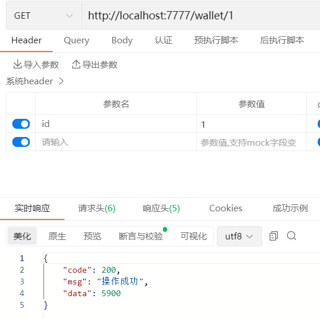
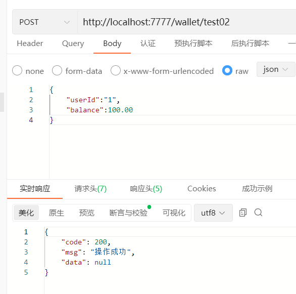
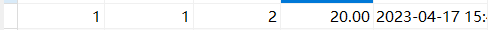
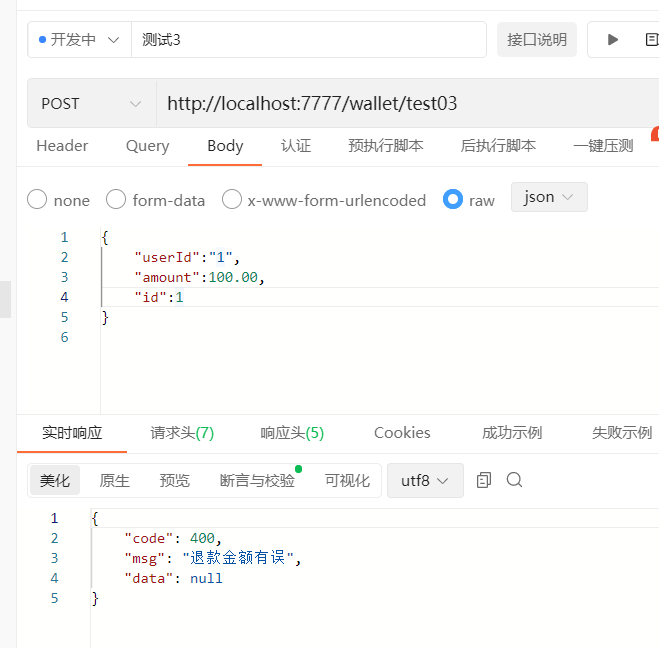
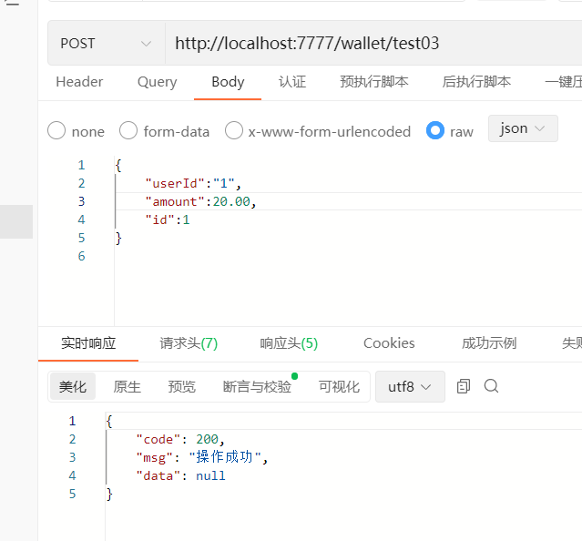
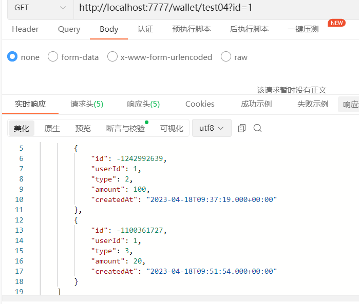

# 数据库设计

## 用户表

~~~sql
CREATE TABLE user(
	id INT PRIMARY KEY COMMENT'用户id',
	name VARCHAR(20) COMMENT '用户姓名'
)
~~~

## 钱包表

~~~sql
CREATE TABLE wallet(
	user_id INT PRIMARY KEY COMMENT'用户id',
	balance DECIMAL(10,2) COMMENT'余额，保留两位小数'
)
~~~

## 交易记录表

~~~sql
CREATE TABLE wallet_record(
	id INT PRIMARY KEY,
  user_id INT,
  type INT COMMENT'1充值，2消费，3退款，4提现',
  amount DECIMAL(10,2),
  created_at TIMESTAMP DEFAULT CURRENT_TIMESTAMP COMMENT'交易时间，默认当前时间'
)
~~~

# 接口测试

## 查询余额

## 用户消费100

## 用户退款20

## 查询明细

id应该用long
